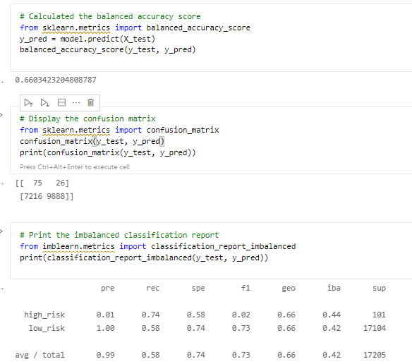
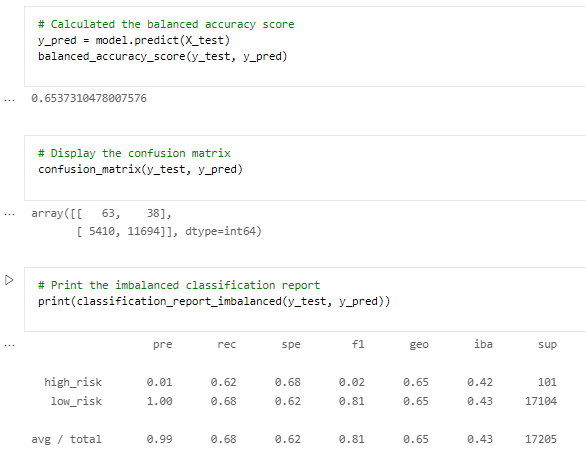
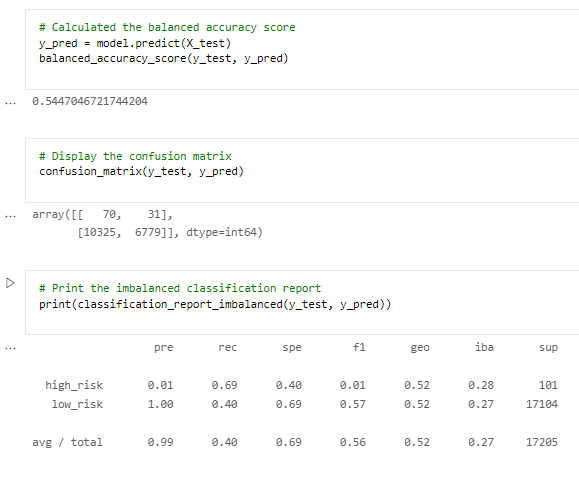
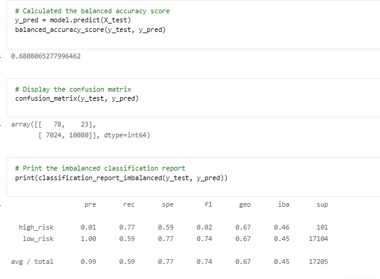
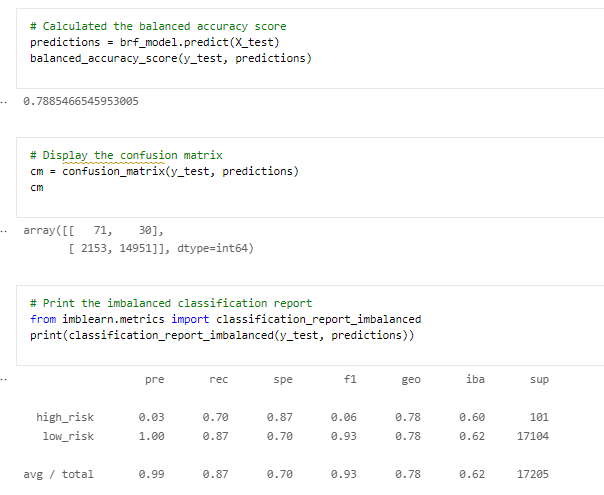
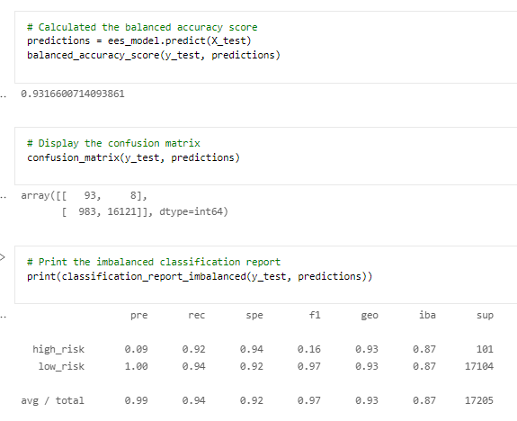

# Credit_Risk_Analysis

# Purpose

The purpose of this is to use the credit card credit dataset from LendingClub and over and under-sample the data and use two machine learning models that reduce bias to predict credit risk. 

# Results

### Naive Random Oversampling:

* Balanced Accuracy Score: 0.67
* The high_risk precision is .01, recall score of 0.67 and an F1 score of 0.02
* The high number of the low_risk population shows a precision of 0.99 with a sensitivity of 0.67 and an F1 score of 0.80

### SMOTE Oversampling:

* Balanced Accuracy Score: 0.63
* The high_risk precision is .01, recall score of 0.57 and an F1 score of 0.02
* The high number of the low_risk population shows a precision of 1.0 with a sensitivity of 0.68 and an F1 score of 0.81

### Cluster Centroids Undersampling:

* Balanced Accuracy Score: 0.63
* The high_risk precision is .01, recall score of 0.57 and an F1 score of 0.02
* The high number of the low_risk population shows a precision of 1.0 with a sensitivity of 0.68 and an F1 score of 0.81

### SMOTEENN - Combination Sampling to assess Credit Risk:

* Balanced Accuracy Score: 0.65
* The high_risk precision is .01, recall score of 0.72 and an F1 score of 0.02
* The high number of the low_risk population shows a precision of 1.0 with a sensitivity of 0.58 and an F1 score of 0.73

## Using Ensemble Algorithms to assess Credit Risk

### Balanced Random Forest Classifier:

* Balanced Accuracy Score: 0.79
* The high_risk precision is .03, recall score of 0.71 and an F1 score of 0.06
* The high number of the low_risk population shows a precision of 1.0 with a sensitivity of 0.88 and an F1 score of 0.93

### Easy Ensemble Classifier

* Balanced Accuracy Score: 0.926
* The high_risk precision is .08, recall score of 0.91 and an F1 score of 0.14
 * The high number of the low_risk population shows a precision of 1.0 with a sensitivity of 0.94 and an F1 score of 0.97

# Summary

After completing both the Credit Risk Analysis and the Credit Risk Ensemble, it is clear that the Ensemble models produce higher accuracy than the others. Particulary the Easy Ensemble Classifier which has the highest score at 0.926. The Balanced Random Forest Classifier was a bit lower at 0.79 but that is still higher than the Combination Sampling(.065), Cluster Centroids Undersampling (0.63), SMOTE Oversampling (0.63), and Naive Random Oversampling (0.67). Based on these results I would recommend usung the Easy Ensemble Classifier model. 

